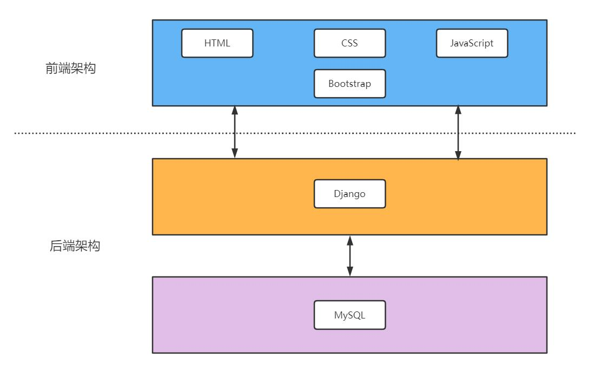

# 商城系统

## 架构设计

## 后台功能

## [mysql安装](https://www.runoob.com/mysql/mysql-install.html)
mysql密码修改
- 关闭服务   
sudo service mysql stop
- 修改文件  
sudo vi /etc/mysql/my.cnf
- 启动服务  
sudo service mysql start
- 登录  
mysql -uroot -p
- 修改密码(不同版本)  
ALTER USER 'root'@'localhost' IDENTIFIED WITH mysql_native_password BY '123456';  
update mysql.user set authentication_string=password('123456') where user='root';  
flush privileges;
- 关闭服务   
- 删除my.cnf增加的内容
- 启动